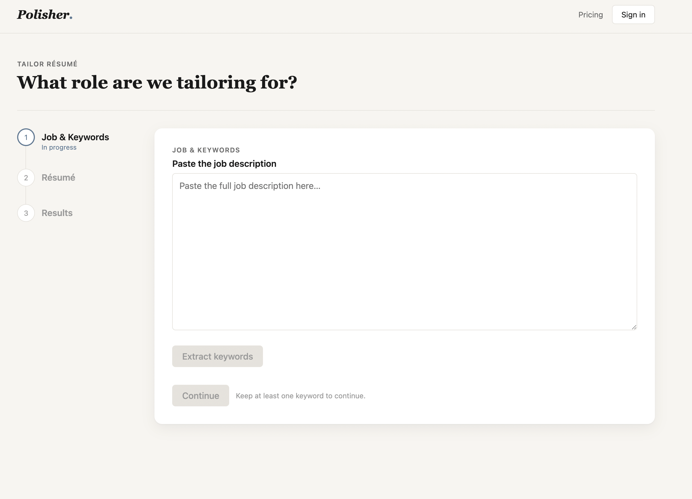

English | [中文](README.zh-CN.md)

# Polisher

Polisher is an AI-powered resume optimization assistant that helps job seekers quickly tailor their resumes to a specific job description (JD), improving the odds of passing ATS (Applicant Tracking System) screening, while also providing general resume improvement suggestions.



## How it works

Polisher is a three-step wizard:

1. **Job & Keywords** — Paste the target job description. The backend extracts the key terms and skill requirements, presented as editable chips so you can drop irrelevant ones before continuing.
2. **Résumé** — Upload your resume (PDF). Its text is parsed and fed, together with the confirmed keywords, into a two-pass tailoring pipeline.
3. **Results** — Preview the tailored resume in an inline-editable document, reorder/toggle sections, and download it as a print-ready PDF. A **Tailor for a new job** button resets the wizard so you can immediately target a different JD.

Under the hood, tailoring runs as a [LangGraph](https://langchain-ai.github.io/langgraph/) two-pass pipeline: a **tailor** pass rewrites experience bullets to cover the target keywords, followed by a **refine** pass that smooths the wording back to natural, human-sounding prose. Both passes call Claude via `langchain-anthropic`.

## Tech stack

- **Backend:** Python, FastAPI, LangGraph + LangChain, Anthropic Claude. PDF parsing via `pdfplumber`; PDF rendering via a Jinja2 HTML template + WeasyPrint.
- **Frontend:** React 19 + TypeScript + Vite, with `@dnd-kit` for section drag-and-drop.

## API

The backend exposes three endpoints under `/api`:

| Endpoint | Method | Purpose |
| --- | --- | --- |
| `/api/keywords/extract` | POST | Extract keywords from a pasted JD (JSON body) |
| `/api/resume/tailor` | POST | Tailor an uploaded resume against the keywords (multipart form) |
| `/api/resume/export` | POST | Render the final resume to a downloadable PDF |

## Project structure

```
app/                    # FastAPI backend
├── main.py             # App entry: CORS, router mount, health check
├── config.py           # Settings / env loading
├── schemas.py          # Pydantic request/response models
├── api/routes.py       # The three /api endpoints
├── chains/             # LangChain chains (extract_keywords, tailor, refine_bullets)
├── graph/              # LangGraph two-pass pipeline (build, nodes, state)
├── prompts/            # Prompt templates
├── services/           # pdf_parser, pdf_renderer, bullet_refiner, jd_fetcher, sanitize
└── templates/resume.html   # Jinja2 template used to render the export PDF

frontend/               # React + Vite frontend
└── src/
    ├── App.tsx         # Top-level view + wizard state
    ├── pages/Home/     # Landing page
    ├── steps/          # JobKeywords, ResumeUpload, Results
    ├── components/     # Navbar, StepIndicator, KeywordChips, Wordmark
    ├── api/            # Backend client
    ├── styles/         # Design tokens + resume styles
    └── types/          # Shared TypeScript types

scripts/                # Local dev + manual try-out scripts
```

## Getting started

### Prerequisites

- Python 3.11 with a virtualenv at `.venv` and dependencies from `requirements.txt`
- Node.js with `frontend/node_modules` installed (`npm install`)
- An Anthropic API key
- macOS only: WeasyPrint needs the native Pango/Cairo libs (`brew install pango`)

### Configuration

```bash
cp .env.example .env                  # set ANTHROPIC_API_KEY
cp frontend/.env.example frontend/.env # VITE_API_BASE_URL=http://localhost:8000
```

### Run the backend (`http://localhost:8000`)

```bash
source .venv/bin/activate
uvicorn app.main:app --reload --port 8000
```

On an Apple Silicon Mac, prefix the command so WeasyPrint can load its native libraries:

```bash
DYLD_LIBRARY_PATH=/opt/homebrew/lib uvicorn app.main:app --reload --port 8000
```

### Run the frontend (`http://localhost:5173`)

```bash
cd frontend
npm run dev
```

Then open `http://localhost:5173` and you'll land on the wizard shown above.

## Status

The project is in early development. The current MVP focuses on the "JD-targeted optimization" feature end-to-end (extract → tailor → refine → export).
